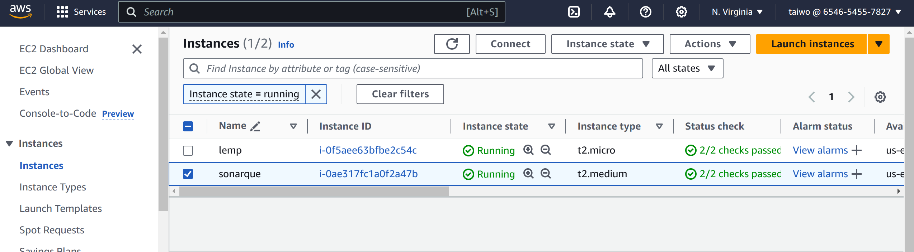

# WORKING WITH SONARQUBE - POSTGRES

- Step 1  
  Set up your Ec2 instance with right configuration and family type of at least t2.medium
  **NB:** Sonarqube requires atleast 250GiB   

    


- step 2  
  Install sonarqube and postgres using the docker image 

  ```
  sudo docker pull postgres
  ```  
  ```
  sudo docker pull sonarqube
  ```  
  confirm your installation by running  
  ```
  sudo docker images
  ```
    


- step 3  
  Install requirements for sonarqube to function
  Copy and paste the following commands
  ```
  sudo apt install default-jre 
  ```  
  ```
   sudo sysctl -w vm.max_map_count=524288 
  ```
  ```
   sudo sysctl -w fs.file-max=131072 
  ```
  ```
  ulimit -n 131072
  ```
  ```
  ulimit -u 8192
  ```
    

  Still installing necessary requirements  
  ```
  sudo docker volume create --name sonarqube_data
  ```
  ```
  sudo docker volume create --name sonarqube_logs
  ```
  ```
  sudo docker volume create --name sonarqube_extensions
  ```  
- step 4  
  The next thing is to run postgres as a container
  ```
  sudo docker run -d --name <container name> -e POSTGRES_PASSWORD=<your password> -e POSTGRES_USER=<your username> -e POSTGRES_DB=<name of database> postgres 
  ```
    


  Confirm your container is running
  ```
  sudo docker ps -a
  ```
    

  Now run Sonarqube as a container
  ```
  sudo docker run -d --name <container name> -p 80:9000 --link <postgress container name>:db -e SONAR_JDBC_USERNAME=same user -e SONAR_JDBC_PASSWORD=same password -e SONAR_JDBC_URL=jdbc:postgresql://<postgress cointainer name>:5432/<postgres db name> sonarqube
  ```
   
   Confirm your container is running 
  ```
  sudo docker ps -a
  ```
    
  

- Now sonarqube is up and running on our port  
  
  
  

  